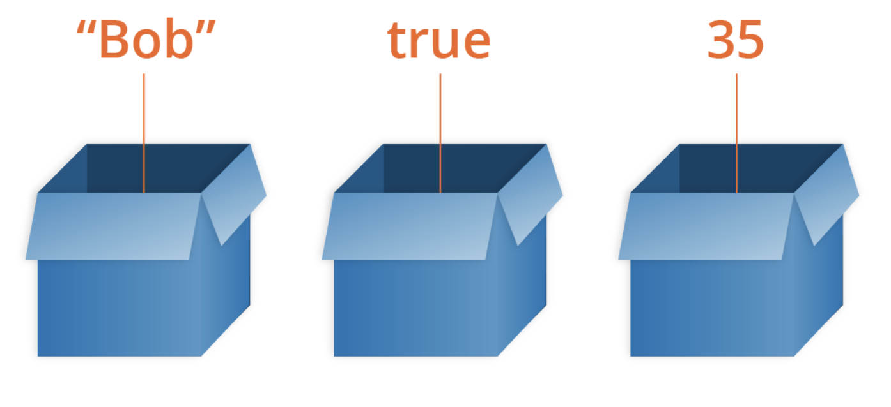

# On9-Accenture-S2-Logica

Lógica - Variáveis, Operadores e Condicional

## Objetivos

Entender os princípios básicos de lógica de programação utilizando a linguagem JavaScript

## Quem é o JavaScript na fila do pão?

JavaScript é uma linguagem de programação que permite a você implementar itens complexos em páginas web — toda vez que uma página da web faz mais do que simplesmente mostrar a você informação estática — mostrando conteúdo que se atualiza em um intervalo de tempo, mapas interativos ou gráficos 2D/3D animados, etc. — você pode apostar que o JavaScript provavelmente está envolvido. É a terceira camada do bolo das tecnologias padrões da web, duas das quais (HTML e CSS) nós falamos com muito mais detalhes em outras partes da Área de Aprendizado.

[referência: MDN](https://developer.mozilla.org/pt-BR/docs/Learn/JavaScript/First_steps/O_que_e_JavaScript)

A linguagem JavaScript também é utilizada para criar aplicações backend (que é o foco do nosso curso). O Node.js é um ambiente de execução Javascript server-side
Você pode aprender um pouco mais sobre o que é o Node e como ele funciona [aqui](https://developer.mozilla.org/pt-BR/docs/Learn/Server-side/Express_Nodejs/Introdu%C3%A7%C3%A3o).

> Dica 💡
>
> HTML e CSS são linguagens de marcação.
> Linguagens de marcação são usadas para descrever e definir elementos dentro de um documento.
> JavaScript é uma linguagem de programação.
> Linguagens de programação são usadas para comunicar instruções a uma máquina.
> Elas podem ser usadas para controlar o comportamento de uma máquina e expressar algoritmos.

## História do JavaScript

[HipstersPontoTube](https://www.youtube.com/watch?v=NaVSbnnV75Q)

## Navegadores e ferramentas de desenvolvimento

#### Google Chrome

As ferramentas do desenvolvedor do Chrome são um conjunto de ferramentas de autoria e depuração internas do Google Chrome. Use as ferramentas do desenvolvedor para iterar, depurar e analisar seu site. Para saber mais, [clique aqui](https://developers.google.com/web/tools/chrome-devtools/).

Para abrir as ferramentas do desenvolvedor do Chrome, clique com o botão direito do mouse em qualquer elemento da página e selecione Inspect ou abra o menu do Chrome, no canto superior direito da janela de seu navegador, e selecione More Tools > Developer Tools. Como alternativa, você pode usar os seguintes atalhos:

`Command (⌘)` + `Option` + `i` (Mac)

`Ctrl` + `Shift (⇧)` + `i` (Windows/Linux).

[Atalhos de teclado das ferramentas de desenvolvedor do Chrome](https://developers.google.com/web/tools/chrome-devtools/shortcuts)

### Mozilla Firefox

As ferramentas do desenvolvedor do Firefox permitem que você examine, edite e depure HTML, CSS e JavaScript no desktop e no celular. Além disso, você pode baixar uma versão do Firefox chamada Firefox Developer Edition, que é personalizada para desenvolvedores, apresentando os últimos recursos do Firefox e ferramentas do desenvolvedor experimentais. Para saber mais, [clique aqui](https://developer.mozilla.org/en-US/docs/Tools).

Para abrir as ferramentas do desenvolvedor do Firefox, clique com o botão direito do mouse em qualquer elemento da página e selecione Inspect Element ou abra o menu do Firefox, no canto superior direito da janela de seu navegador, e selecione Developer. Como alternativa, você pode usar os seguintes atalhos:

`Command (⌘)` + `Option` + `i` (Mac)

`Ctrl` + `Shift (⇧)` + `i` (Windows/Linux).

### console.log

`console.log` é um comando usado para exibir conteúdo para o console do JavaScript. Rode o seguinte código no console:

```
console.log("Olá mundo!");
```

Parabéns! Você realizou a ação de log no console de depuração.

A mensagem que você registrou é **"Olá mundo!"**. `Olá mundo!` é uma _string_ (uma sequência de caracteres).

---

### O que é um Algoritmo?

A resposta para essa pergunta é mais simples do que parece algoritmos são uma sequência de ações finitas que levam a determinado um resultado.

Ou seja, é uma forma automática de fazer as coisas, como, por exemplo, levantar da cama e se preparar para então começar um dia de trabalho ou seguir todos os dias o mesmo caminho e pegar o mesmo ônibus para chegar a um determinado ponto. É um passo a passo de ações. Assim funciona um algoritmo.

Algoritmo básico para assar um pão:


> Dica 💡
>
> Jogo para treinar algoritmos: [Lighbot](https://play.google.com/store/apps/details?id=com.lightbot.lightbothoc&hl=en).
> Faça o robozinho andar e acender a luzinha. Você vai perceber que o computador faz apenas aquilo que você manda.😼

💡[Ada Lovelace, a primeira programadora de todos os tempos](https://canaltech.com.br/curiosidades/mulheres-historicas-ada-lovelace-a-primeira-programadora-de-todos-os-tempos-71395/)

---

### Tipos de dados e variáveis

#### Números

Definir um número em JavaScript é, na verdade, bem simples. O tipo de dado number inclui qualquer inteiro positivo ou negativo, bem como decimais. Inserir um número no console fará com que o mesmo valor seja retornado para você

##### Operações aritméticas

Você também pode fazer cálculos com números de maneira bem fácil. Basicamente, digite uma expressão da mesma maneira que você a digitaria em uma calculadora.

`3 + 2.1`

> **Returns**: _5.1_

##### Agora é sua vez!

Insira as expressões (uma de cada) no console e determine o resultado de cada uma.

`2 + 10 - 19 + 4 - 90 + 1`

`-20 + -19 - (-10) - (-1) + 24`

`(10/5) \* 4 - 20`

`4096 % 12`

##### Comparando números

E quanto à comparação de números? Você consegue fazer isso? Mas é claro que consegue!

Assim como na matemática, você pode comparar dois números para verificar se um é maior, menor ou igual ao outro.

`5 > 10`

> Returns: _false_

`5 < 10`

> Returns: _true_

`5 == 10`

> Returns: _false_

Comparações entre números irá resultar em verdadeiro ou falso. Veja na tabela abaixo outros exemplos de comparações que podemos fazer:

##### Operadores lógicos

| Operador | Significado      |
| -------: | ---------------- |
|        < | Menor que        |
|        > | Maior que        |
|       <= | Menor ou igual a |
|       >= | Maior ou igual a |
|       == | Igual a          |
|       != | Diferente de     |

##### Agora é com você

**Quizz**: https://app.sli.do/event/mh6zxmqx

#### String

**String** é uma sequência de caracteres usados para representar texto.

```javascript
"Variáveis em Javascript são uma forma para se salvar dados";

"Reprograma";

"1 é um número ímpar";
```

##### Concatenação de strings

Strings são uma coleção de caracteres agrupados entre aspas simples ou duplas. Você pode utilizar strings para representar dados como frases, nomes, endereços e mais.

Você sabia que é possível até mesmo somar strings? Em JavaScript, isso é chamado de **concatenação**. Concatenar duas strings é, na verdade, bem simples!

`"Hello," + " New York City"`

> Retorna: "Hello, New York City"

Você verá outras maneiras de fazer concatenação e fazer até mais coisas com strings mais adiante neste curso.
Mas, por agora, pratique utilizando o operador de adição `+`.

##### Agora é com você!

[**Quizz**](https://forms.gle/vAXGQygafDya8Jte7)

#### Boolean

é um tipo de dado lógico que pode ter apenas um de dois valores possíveis: verdadeiro ou falso.

```javascript
false;
true;
```

#### Null

representa um valor nulo ou "vazio".

```javascript
var y = null;
console.log(y);
```

> `null`

#### Variáveis

Uma variável é um **container para um valor**, como um número que podemos usar em uma operação de adição, ou uma sequência de texto que possamos usar como parte de uma frase. Mas uma coisa especial a respeito das variáveis é que **seu conteúdo pode mudar**.



Toda vez que precisarmos armezanar e recuperar dados utilizaremos variáveis.

No Javascript temos 3 maneiras de usar variáveis:

- `var` (no console vamos usar essa)
- `let`
- `const`

```javascript
var numero = 1;
var texto = "Vamos reprogramar o mundo no domingo.";
```

##### Convenções de nomenclatura

Quando cria uma variável, você escreve o nome da variável utilizando **camelCase** (a primeira palavra em minúsculo e as palavras seguintes, em maiúsculo).

Também tente utilizar um nome de variável que, de maneira precisa, porém sucinta, descreve do que aquele dado se trata.

```javascript
var totalAfterTax = 53.03; // utiliza camelCase se o nome da variável tiver múltimas palavras
var tip = 8; // utiliza letras minúsculas se o nome da variável tiver somente uma palavra
var firstName = "Pabllo";
var counter = 1;
```

Não utilizar camelCase no nome de suas variáveis não vai, necessariamente, danificar alguma coisa em JavaScript.

Porém, existem guias de estilo recomendados para todas as linguagens de programação que ajudam a manter o código consistente, limpo e fácil de ser lido.

Isso é especialmente importante quando trabalhamos com projetos maiores, que serão acessados por diversas pessoas desenvolvedoras.

Você pode ler mais sobre o Guia de Estilo JavaScript do Google [aqui](https://google.github.io/styleguide/jsguide.html).

##### Declarando variáveis

Um identificador JavaScript deve começar com:

- uma letra
- underline (\_)
- cifrão (\$)

Os caracteres subsequentes podem também ser

- números (0-9)
- letras incluem caracteres de "A" a "Z" (maiúsculos)
- caracteres de "a" a "z" (minúsculos)

Uma variável não pode ser uma palavra reservada, [clique aqui para saber quais são](https://developer.mozilla.org/en-US/docs/Web/JavaScript/Reference/Lexical_grammar#Keywords)

**Exercício extra:** <https://developer.mozilla.org/pt-BR/docs/Learn/JavaScript/First_steps/Teste_suas_habilidades:_variaveis>

---

### Ferramentas para receber dados de maneira interativa

O `alert` mostra uma mensagem na tela como um pop-up.

```javascript
var mensagem = "Mensagem que vai aparecer no nosso alerta";
alert(mensagem);
```

O confirm é um pop-up que oferece uma lógica através de dois botões - o Ok (`true`) e o Cancel (`false`)`

```javascript
var mensagem = "Aperte o botão ok";
confirm(mensagem);
// Se o usuário apertar Ok vai retornar true, se apertar Cancel vai retornar false
```

O prompt é um pop-up que nos oferece um input para coletarmos variáveis.

```javascript
var pergunta = "Digite o seu nome";
prompt(pergunta);
```

```javascript
// TODO - por que o prompt retorna string e como fizemos para tratar isso
```

##### Exercício guiado

Vamos fazer um programa que peça dois números e imprima no console a soma desses dois números.

##### Agora é com você

Escreva um programa que receba um valor em metros e o exiba no `console` convertido em milímetros

---

### Operadores aritméticos e lógicos

#### Operadores de atribuição

O operador de atribuição básico é o igual `(=)`, que atribui o valor do operando à direita ao operando à esquerda.

Exemplo:

```javascript
var diaDaSemana = "domingo";

diaDaSemana = "segunda";

console.log(diaDaSemana); // segunda
```

Isto é, x = y atribui o valor de y a x.

#### Igual

```javascript
const y = 7;
const x = y; // x é igual à 7
```

#### Operadores Aritméticos

##### Adição (+)

```javascript
const y = 7;
const x = 3;

const resultado = y + x;
console.log(resultado); // 10
```

##### Subtração (-)

```javascript
const y = 5;
const x = 2;
const resultado = y - x;
console.log(resultado); // 3
```

##### Multiplicação(\_)

```javascript
const y = 4;
const x = 5;
const resultado = y _ x
console.log(resultado) // 20
```

##### Divisão (/)

O operador de divisão produz o quociente de seus operandos onde o operando da esquerda é o dividendo e o da direita é o divisor.

```javascript
const y = 10;
const x = 2;
const resultado = y / x;
console.log(resultado); // 5
```

##### Módulo (%)

O operador módulo retorna o resto inteiro da divisão de um numero pelo outro.

```javascript
const y = 10;
const x = 2;
const resultado = y % x;
console.log(resultado); // 0
```

##### Operadores de Comparação - Relacional e Igualdade

##### == Igual

Retorna verdadeiro caso os operandos sejam iguais.

```javascript
3 == 3; // true
"3" == 3; // true
3 == "3"; // true
```

##### != Não igual (diferente)

Retorna verdadeiro caso os operandos não sejam iguais.

```javascript
5 != 4; // true
"4" != "3"; // true
```

##### === Estritamente igual

Retorna verdadeiro caso os operandos sejam iguais e do mesmo tipo. Veja também Object.is e igualdade em JS.

```javascript
3 === "3"; // false
```

#### !== Estritamente não igual (diferente)

Retorna verdadeiro caso os operandos não sejam iguais e/ou não sejam do mesmo tipo.

```javascript
3 !== "3"; // true
3 !== "3"; // true
```

O _double equals_ vai tentar nos ajudar na comparação, e ao notar que estamos tentando comparar tipos diferentes (string e number) ele vai tentar converter a string para number. No caso acima ele consegue e por isso temos o resultado true.

Entao por baixo dos panos o que aconteceu foi: 

```javascript
2 == Number("2") //true
```

Com o _triple equals_ o JavaScript nunca tenta converter os valores. Por isso, o resultado `false`.

Sendo assim, **recomenda-se usar o triple equals para evitar surpresas**.

E a internet não perdoa as surpresas:


> Dica
>
> Saiba mais sobre [coerção implícita do javascript](https://dev.to/promhize/what-you-need-to-know-about-javascripts-implicit-coercion-e23#:~:text=Javascript's%20implicit%20coercion%20simply%20refers,it%20to%20the%20right%20type.)


##### > maior que
O operador de Maior retorna true se o operando da esquerda for maior que o operando da direita.

```javascript
4 > 3 // true
```

##### >= maior ou igual a
O operador maior ou igual retorna true se o operando da esquerda for maior ou igual ao operando da direita.

```javascript
4 >= 3 // true
3 >= 3 // true
```

##### < menor que
O operador menor retorna true (verdadeiro) se o operando da esquerda for menor que o operando da direita.

```javascript
3 < 4 // verdade
```

##### <= menor ou igual a
O operador menor ou igual retorna true (verdadeiro) se o operando da esquerda for menor ou igual ao operando da direita.

```javascript
3 <= 4 // verdade
```

#### Operadores Lógicos


##### && E lógico 
Se o primeiro valor for verdadeiro, ou puder ser considerado ou convertido pra verdadeiro retorna o segundo valor.

> Se for feriado **e** estiver sol, vou à praia.
> 
> É feriado? Sim. Está sol? Sim. 🏖️
> 
> É feriado? Não. Está Sol? Sim. 🏠

Se o primeiro valor for falso, retorna falso.

```javascript
true && "oi" // "oi"
"oi" && true // true
true && false // false
```

##### || Ou lógico 
Se o primeiro valor for verdadeiro, ou puder ser considerado ou convertido pra verdadeiro retorna o primeiro valor.

> Se for feriado **ou** estiver sol, vou à praia.
> 
> É feriado? Sim. Está sol? Não. 🏖️🌧️
> 
> É feriado? Não. Está sol? Sim. 🏖️👀

Se o primeiro valor for falso, retorna o segundo valor.

```javascript
false || true // true
false || false // false
false || "oi" // "oi"
false || 0 // 0
```

##### ! Não lógico 
Esse operador inverte o valor de uma expressão

Obs: Se um valor pode ser convertido para verdadeiro, este valor é chamado de truthy. Se um valor pode ser convertido para falso, este valor é chamado de falsy.

Exemplos de expressões que podem ser convertidas para falso são:

- null;
- NaN;
- 0;
- string vazia (""); 
- undefined.

Todos os outros são considerados verdadeiros.

```javascript
!true // false
!false // true
!'Oi' // false
!'' // true
```
---

## Condicionais

Usamos para verificar uma condição e definir se algo deve ou não acontecer a partir da condição dada.

É a linguagem que utilizamos para nos comunicar, repare:

Se amanhã fizer sol, vou viajar para a praia.

Temos uma condição (Se amanhã fizer sol) para executar uma ação (viajar para a praia) dependendo do resultado dessa condição. Se verdadeira, a ação é executada.

#### Expressões condicionais simples

```javascript
// Variável booleana verdadeira
const sol = true;

// Condição
if ( sol ) {
	// Ação
	console.log('Vou viajar para a praia!');
}
```

#### Estrutura if / else

```javascript
// Variável booleana verdadeira
const sol = false;

// Condição
if ( sol ) {
	// Ação
	console.log('Vou viajar para a praia!');
}else{
	// Ação
	console.log('Vou ao cinema');
}
```


#### Estrutura if / else if / else

```javascript
// Variável booleana verdadeira
const hora = 8;

// Condição
if ( hora <= 12 ) {
	// Ação
	console.log('Bom dia');
}else if( hora <= 18){
	// Ação
	console.log('Boa tarde');
}else{
	// Ação
	console.log('Boa noite');
}
```

```javascript
if ( condição ) {
	// Ação
} else if ( outra condição ) {
	// Ação
} else if ( outra condição ) {
	// Ação
} else if ( outra condição ) {
	// Ação
} else if ( quantas condições quiser ) {
	// Ação
} else {
	// Ação final se nenhuma condição for verdadeira
}
```
#### Estrutura switch

```javascript

switch (expression) {
  case choice1:
    run this code
    break;

  case choice2:
    run this code instead
    break;
    
  // include as many cases as you like

  default:
    actually, just run this code
}
```


> Dica
> 
> [Tomando decisões no seu código — condicionais](https://developer.mozilla.org/pt-BR/docs/Aprender/JavaScript/Elementos_construtivos/conditionals)
> 

#### Exercício guiado

Vamos escrever um programa que receba um número digitado no `prompt`

Então, se o número for múltiplos de 3 o console imprimirá a palavra **“Fizz”** .

Se for múltiplo de 5 mostraremos **“Buzz”**. 

Agora, se ele for múltiplo de 3 e 5 mostre **“FizzBuzz”**.

#### Agora é com você:

Receba uma palavra pelo `prompt` e diga se essa palavra começa com uma vogal. Imprima **sim** ou **não** no console.
